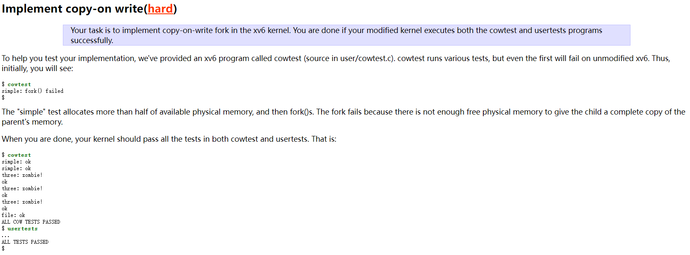
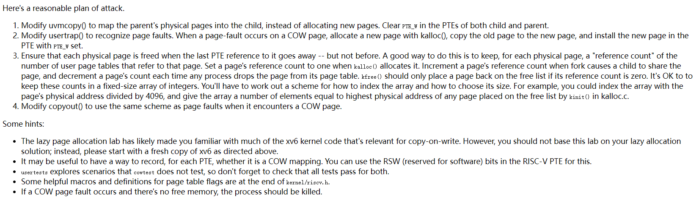
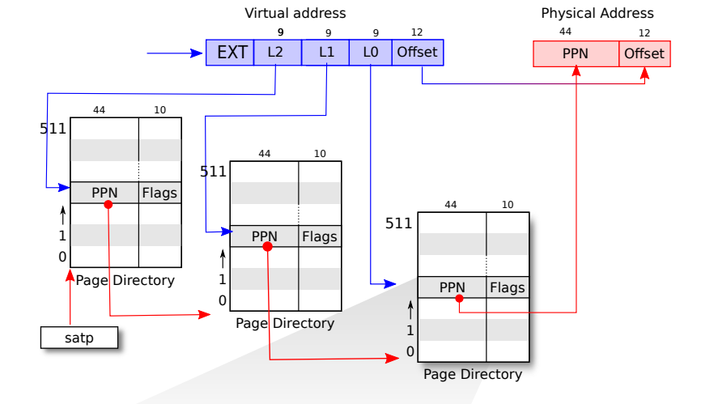
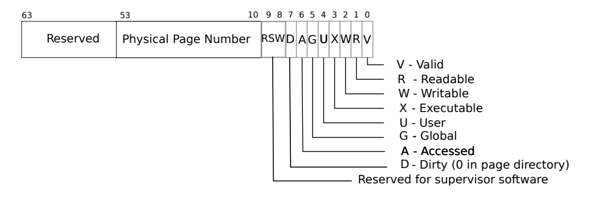
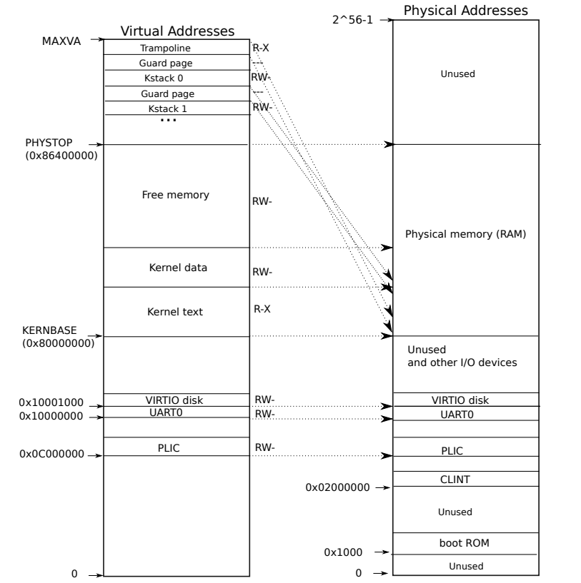
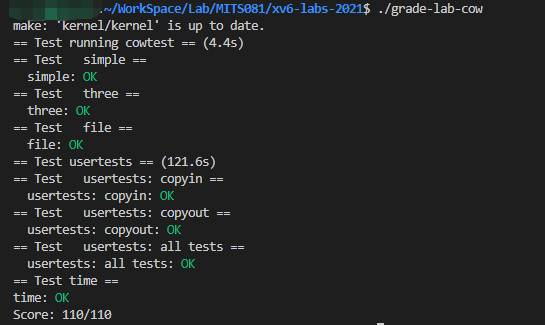

risc-v的isa

> 需要注意的是pc寄存器保存的是**当前运行代码的地址**而不是下一条
>

gdb调试常用指令

> ```bash
>make CPUS=1 qemu-gdb
> 
> gdb-multiarch
> 
> 调试指定可执行文件：file 可执行文件
> 
> layout split #查看源代码和汇编代码
> ni #单步执行汇编（不进函数）
> si #单步执行汇编（进入函数）
> n #单步执行源码（不进函数）
> s #单步执行源码（进入函数）
> 
> p $a0 #打印寄存器a0的值
> i r a0 #查看寄存器a0的值
> p/x 1536 #以16进制打印1536
> x/i 0x630 #查看0x630地址处的指令
> x /x addr #查看addr地址处的值
> 
> b *addr：使断点停到address地址处
> ```
> 

### Lab:  Copy-on-Write Fork for xv6

> 需要注意的是我们做的实验是2021的，因此要找到2021的指导书
>
> 前期准备
>
> ```bash
> git fetch
> git checkout cow //在进行这句话的时候确保实验一已经commit
> make clean
> ```

> 操作系统通过**页表**进行隔离，使得每个应用程序都有属于它们自己的地址空间
>
> 目前的xv6如果发生**缺页**的情况也会从用户空间进入到内核空间。对于STVAL（指向trampoline，程序切换到内核同时会将出错的地址存放到STVAL寄存器）和SCAUSE寄存器（记录是什么情况发生的缺页）都会有相应的值。
>
> 因此发生缺页时我们关注的三个情况：
>
> - 引起page fault的内存地址，STVAL
> - 引起page fault的原因类型，SCAUSE
> - 引起page fault的程序计数器值

> sbrk位于heap的最底端同时位于stack的最顶端，它是xv6提供的系统调用，能够让用户扩大自己的heap

#### Implement copy-on write(hard)

首先，我们来看看实验要求和提示信息：





1. 当创建子进程时，没必要新建分配并且拷贝内容到新的物理内存，子进程可以共享父进程的物理内存，但是要设置PTE的标志未只读。

2. 当需要更改内存中内容时，会触发缺页。由于父子进程之间具有隔离性，因此需要写时复制。具体就是在发生缺页时要拷贝相应的物理内存。比如子进程进行某些操作缺页的时候，需要拷贝物理内存，然后将新拷贝的物理内存映射到子进程。这样，子进程就可以将相应的PTE设置为可读写。然后刚才触发缺页的那个父进程的物理页对于父进程也变成可读可写了。

3. 内核需要能认识到这是个COW的场景，因此要用到标志位，可以考虑用保留位。

4. 还需要对每一个物理内存的引用进行计数，因为释放虚拟页的时候有可能还有其他进程在用这个物理页，需要当引用计数为0的时候才可以释放物理页。

   





> - xv6每个进程拥有一个独立页表，同时内核也拥有一个页表用于描述内核地址空间。内核地址空间定义在memlayout.h中
> - xv6中处于内核态时使用内核页表，内核页表映射的虚拟地址和物理地址相等。xv6处于用户态时，每个进程都有自己的页表，映射该进程的虚拟地址到物理地址，由于内核页表不包含这些映射，用户地址在内核中式无效的。因此，当系统调用传递一个用户指针给内核时，内核需要将该指针映射为物理地址。
> - 内核页表中的内容为所有进程共享，每个进程都有自己的进程页表
> - xv6为每个进程维护一个页表描述每个进程的用户地址空间，另外还有一个页表描述内核的地址空间。

[6.s081 2021 lab5 Copy-on-Write Fork for xv6 - 知乎 (zhihu.com)](https://zhuanlan.zhihu.com/p/463029980)

> - 与地址空间有关的代码主要在vm.c文件中。pagetable_t代表一级页表，实际数据类型是一个指针，指向页表的物理地址。walk函数是最核心的函数，该函数通过页表将虚拟地址va转换为PTE，如果alloc为1就会分配一个新页面
>
> - MAKE_SATP是产生SATP的值，后面用sfence_vma刷新TLB完成虚拟地址转换的开启
>
> - 当进程申请内存的时候，内核会先调用kalloc申请物理页面，之后构造PTE加入到进程对应页表项中
>
> - 在进程地址空间的最高位置为trampoline，所有进程的该页面映射到同一个物理页面上。同样地，在用户栈地下方也设置了一个guard page来防止缓冲区溢出。
>
> - 为了使分页机构能够正常运行，操作系统必须设置satp寄存器为1级页表的物理地址
>
> - ```
>   walk:通过页表将虚拟地址va转换为PTE
>   mappages:在页表中建立一段虚拟内存到物理内存的映射
>   kvm开头的函数操作内核页表,uvm开头的函数操作用户页表
>   copyout和copyint将数据复制到作为系统调用参数提供的用户虚拟地址并从中复制数据
>   它们在vm.c中需要显示转换为物理地址
>   ######
>   在boot loader的早期首先调用kvminit来创建内核的页表，调用kvminit的时候cpu还未启动分页硬件，因此地址直接指向内存
>   main调用kvminthart来安装内核页表。它将根页表的物理地址写入寄存器satp中，在此之后cpu将使用内核页表转换地址，对于内核页表来书，内核页表和物理页表是直接映射的
>   ```
>

> - 添加PTE_C标志位
>
>   ```c
>   // kernel/riscv.h
>   #define PTE_C (1L << 8)
>   ```
>
> - 修改uvmcopy，父子进程同时用一个物理页，并且需要清空PTE_W，添加PTE_C
>
>   ```c
>   // kernel/vm.c
>   int uvmcopy(pagetable_t old, pagetable_t new, uint64 sz)
>   {
>     pte_t *pte;
>     uint64 pa, i;
>     uint flags;
>   
>     for(i = 0; i < sz; i += PGSIZE){
>       if((pte = walk(old, i, 0)) == 0)
>         panic("uvmcopy: pte should exist");
>       if((*pte & PTE_V) == 0)
>         panic("uvmcopy: page not present");
>         
>       pa = PTE2PA(*pte);
>   
>       *pte &= (~PTE_W);//清除PTE_W
>       *pte |= (PTE_C);//设置PTE_C
>   
>       flags = PTE_FLAGS(*pte);
>       //物理地址用原来的
>       if(mappages(new, i, PGSIZE, pa, flags) != 0){
>         goto err;
>       }
>   
>   
>     }
>     return 0;
>   
>    err:
>     uvmunmap(new, 0, i / PGSIZE, 1);
>     return -1;
>   }
>   ```
>
> - 修改trap的handler
>
>   ```c
>   // kernel/trap.c
>   else if (r_scause() == 15) {
>   	uint64 va = r_stval(); //获取出错的地址va
>       if (is_cow(p->pagetable, va)) {
>           if (cow_alloc(p->pagetable, va) == 0) {
>               p->killed = 1;
>           }
>       }
>   }
>   ```
>
> - 实现is_cow函数，判断是否是COW
>
>   ```c
>   //稍微可以借鉴walkaddr函数(kernel/vm.c)，根据虚拟地址返回物理地址
>   // kernel/vm.c
>   int is_cow(pagetable_t pagetable, uint64 va) {
>   	pte_t *pte;
>       if (va >= MAXVA) {
>           return 0;
>       }
>       if ((pte = walk(pagetable, va, 0)) == 0) {
>           return 0;
>       }
>       if ((*pte & PTE_V) == 0) {
>           return 0;
>       }
>       if ((*pte & PTE_U) == 0) {
>           return 0;
>       }
>       return 1;
>   }
>   ```
>
> - 实现cow_alloc函数，判断能否进行物理页的复制
>
>   ```c
>   // kernel/vm.c
>   uint64 cow_alloc(pagetable_t pagetable, uint64 va) {
>       va = PGROUNDDOWN(va);
>       pte_t *pte = walk(pagetable, va, 0);
>       char* mem = kalloc();
>       if (mem == 0) {
>           return 0;
>       }
>       uint64 pa = PTE2PA(*pte);
>       memove(mem, (char*)pa, PGSIZE);
>   
>   
>       uint flags = PTE_FLAGS(*pte);
>       (*pte) = PA2PTE((uint64)mem) | flags;
>       (*pte) |= PTE_W;
>       (*pte) &= ~PTE_C;
>       kfree((void*)pa);
>       return (uint64)mem;
>   }
>   ```
>
> - 观察上面代码发现我们调用了kalloc和kfree函数，加上提示也提到了，因此需要进行修改。并且根据提示，需要定义物理页的引用计数数组
>
> - 定义物理页引用计数数组
>
>   ```c
>   // kernel/kalloc.c
>   int ref[PHYSTOP/PGSIZE];
>   ```
>
> - 修改kinit，添加物理页引用初始化
>
>   ```c
>   // kernel/kalloc.c
>   void kinit() {
>       initlock(&kmem.lock, "kmem");
>       for (int i = 0; i < PHYSTOP/PGSIZE; i++)
>           ref[i] = 0;
>       freerange(end, (void*)PHYSTOP);
>   }
>   ```
>
> - 修改kalloc，刚开始分配物理页的时候引用计数设为1
>
>   ```c
>   void *kalloc(void)
>   {
>       ...
>       if(r) {
>       	memset((char*)r, 5, PGSIZE); // fill with junk
>           acquire(&kmem.lock);
>       	ref[((uint64)r)/PGSIZE] = 1;
>           release(&kmem.lock);
>     	}
>   	...
>   }
>   ```
>
> - 修改kfree，当物理页引用只为1时才真正free，否则将引用减一即可
>
>   ```c
>   // kernel/kalloc.c
>   void kfree(void *pa) {
>       if(ref[((uint64)pa)/PGSIZE] != 0) {
>           kdecre(pa);
>           if(ref[((uint64)pa)/PGSIZE] != 0) {
>               return;
>           }
>       }
>   
>       struct run *r;
>       ...
>   }
>   
>   // kernel/kalloc
>   void kdecre(void *pa) {
>      acquire(&kmem.lock);
>      ref[((uint64)pa)/PGSIZE]--;
>      release(&kmem.lock);
>   }
>   ```
>
> - 上面出现了引用也减一的函数kdecre，当然也需要有函数kincre
>
>   ```c
>   // kernel/kalloc
>   void kincre(void *pa) {
>      acquire(&kmem.lock);
>      ref[((uint64)pa)/PGSIZE]++; 
>      release(&kmem.lock);
>   }
>   ```
>
> - 实现了kincre后在哪里调用呢，思考一下，因为COW是延迟写。在调用fork，fork调用uvmcopy的时候需要将物理页的引用次数加一
>
>   ```c
>   // kernel/vm.c
>   int uvmcopy(pagetable_t old, pagetable_t new, uint64 sz)
>   {
>   	...
>       //物理地址用原来的
>       if(mappages(new, i, PGSIZE, pa, flags) != 0){
>         goto err;
>       }
>   	kincre((void *)pa);///////
>   	
>     }
>     return 0;
>   
>    err:
>     uvmunmap(new, 0, i / PGSIZE, 1);
>     return -1;
>   }
>   ```
>
>   
>
> - 修改copyout函数。根据提示，和遇到COW缺页的时候一致，因此查看trap的handler
>
>   ```c
>   // kernel/vm.c
>   int copyout(pagetable_t pagetable, uint64 dstva, char *src, uint64 len) {
>       uint64 n, va0, pa0;
>       while (len > 0) {
>           va0 = PGROUNDDOWN(pagetable, va0);
>           if (is_cow(pagetable, va0) == 0) return -1;
>           if (cow_alloc(pagetable, va0) == 0) return -1;
>           
>           pa0 = walkaddr(pagetable, va0);
>           if (pa0 == 0) {
>               return -1;
>           }
>           n = PGSIZE - (dstva - va0);
>           ...
>       }
>   }
>   
>   ```
>
> - 修改defs.h
>
>   ```c
>   // kernel/defs.h
>   
>   // vm.c
>   ...
>   int             is_cow(pagetable_t, uint64);
>   uint64          cow_alloc(pagetable_t, uint64);
>   
>   //kalloc.c
>   ...
>   void            kincre(void *);
>   void            kdecre(void *);
>
>   ```
>   
> - 在根路径下(kernel的上一级目录)建立time.txt，并填入一个整数
>
>   

虚拟机ens33没有网卡， sudo dhclient ens33

#### 测试

```bash
make qemu
ctrl+a+x //退出
./grade-lab-cow
```



#### 总结

> - 在risc_v.h中添加PTE_C标志位代表COW
> - 需要修改uvmcopy，延迟复制，让父子进程都指向同一个物理页表
> - 需要修改trap的handler，实现是否是COW，以及实现写时复制
> - 合理利用walkaddr和walk函数
> - 在kalloc.c中需要定义一个数组用于对物理页计数
> - 需要对计数数组进行初始化，kalloc的之后需要赋值，kfree的时候如果不是最后一个，则只需要减一，不需要真正释放
> - 需要实现计数加一和计数减一的函数
> - 在uvmcopy中父子进程指向同一个物理页表后，需要对物理页表的计数进行加一
> - copyout函数，类似于对trap的handler的修改，这是一个大坑。
> - （可选）对于计数数组可加锁和不加锁都能通过，本教程采用了加锁的方式防止内存泄漏