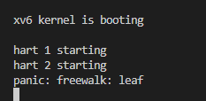

虚拟内存作用：具有隔离性，每个进程有独立的地址空间；然后还能够进行进程虚拟地址到物理地址的映射；MMU是翻译虚拟地址的，页表其实就是虚拟地址到物理地址的表单，存储在内存中。

RISC-V的物理地址有56位，虚拟地址有64位；

页表是4KB的，一个PTE（就是页表中的一行）是8B的，因此，每个表单有512个条目

当一个进程请求一个虚拟内存地址时，CPU会查看**SATP寄存器**得到对应的最高一级page table;

回想一下page table的结构，你可以发现，当处理器从内存加载或者存储数据时，基本上都要做**3次内存查找**，第一次在最高级的page directory，第二次在中间级的page directory，最后一次在最低级的page directory。所以需要缓存，TLB是页表的缓存（虚拟地址到PA），TLB不命中，才去访问页表，因为TLB是页表的缓存，当页表切换的时候，需要清空TLB表

在XV6中，内核有它自己的page table，用户进程也有自己的page table，用户进程指向sys_info结构体的指针存在于用户空间的page table，但是内核需要将这个指针翻译成一个自己可以读写的物理地址。如果你查看copy_in，copy_out，你可以发现内核会通过用户进程的page table，将用户的虚拟地址翻译得到物理地址，这样内核可以读写相应的物理内存地址。

调试工具： `gdb-multiarch`

一般会遇到warning: File "/home/hjj/work/customed_server/session_manager/.gdbinit"

auto-loading has been declined by your `auto-load safe-path' set to "$debugdir:$datadir/auto-load"
类似这种错误；

解决：在home目录下编辑.gdbinit, 加上 set auto-load safe-path /，保存退出即可。

如果pagetable设置错了，翻译的时候可能会产生page fault

**注意：**在课上或者这个网址[4.8 walk 函数 - MIT6.S081 (gitbook.io)](https://mit-public-courses-cn-translatio.gitbook.io/mit6-s081/lec04-page-tables-frans/4.8-walk-han-shu)有讲walk函数的相关参数问题，当alloc不为0的时候，如果参数alloc不为0，且某一个level的page table不存在，这个函数会创建一个临时的page table，将内容初始化为0，并继续运行，所以总是返回最后一级的pagetable；如果参数alloc没有设置，那么在第一个PTE对应的下一级page table不存在时就会返回。我理解是walk函数相当于是模拟了VA的翻译过程

RISC-V中，内核设置了虚拟地址等于物理地址的映射关系，这里很重要。在SATP寄存器设置完之后就开始有了页表，开始用虚拟地址了。

### Lab: page tables

> 需要注意的是我们做的实验是2021的，因此要找到2021的指导书
>
> 前期准备
>
> ```bash
> git fetch
> git checkout pgtbl //在进行这句话的时候确保实验一已经commit
> make clean
> ```

**RISC-V的地址翻译过程：**


**虚拟地址和物理地址的对应关系（大部分是恒等映射）**

题外话：一般来说，内核页表（1G）是多个进程共用的；此外每个进程的用户空间都有一个单独的页表（3G），因此，内核页表对用户空间进行读写的时候需要进行系统调用，对地址进行转换，效率较低。

#### Speed up system calls(easy)

> 首先，我们来看看实验要求和实验提示


> - 通过在用户空间和内核之间的只读区域中共享数据来加快某些系统调用，这样就不需要通过系统调用在内核态和用户态之间进行来回切换，耗费时间
> - 创建每个进程的时候在USYSCALL上映射一个只读页面，在这个页面的开头，存储struct usyscall并且用当前进程的PID对struct usyscall进行初始化
> - ugetpid已经在用户空间提供，并且将自动使用USYSCALL映射，如果通过pgtbltest，将获得这部分的全部分数。

> 我们现在根据提示开始解决这个问题。
>
> 根据提示进行以下步骤：
>
>  1. 在kernel/proc.c文件的proc_pagetable()函数下执行mapping操作
>
>     ```c
>     //kernel/proc.c
>     //依葫芦画瓢
>     if(mappages(pagetable, USYSCALL, PGSIZE,
>                   (uint64)(p->usyscall), PTE_R | PTE_U) < 0){
>         uvmunmap(pagetable, USYSCALL, 1, 0);
>         uvmfree(pagetable, 0);
>         return 0;
>     }
>     ```
>
>  2. 只用用户空间能读这个页面。因此，要给这个页面设置权限位（PTE_R | PTE_U）
>
>  3. 不要忘记在allocproc()的时候初始化这个页面。然后根据题目描述，我们知道需要在页面初始化的是存储当前进程的PID
>
>     ```c
>     //kernel/proc.c
>     //依葫芦画瓢
>     if((p->usyscall = (struct usyscall *)kalloc()) == 0){
>         freeproc(p);
>         release(&p->lock);
>         return 0;
>     }
>       
>     //存储当前进程的PID
>     p->usyscall->pid = p->pid;
>     ```
>
>  4. 在freeproc函数里free这个页面
>
>     ```c
>     //kernel/proc.c
>     if (p->usyscall) {
>         kfree((void*)p->usyscall);
>     }
>     p->usyscall = 0;
>     ```
>
>     然后执行make qemu，结果如下：
>
>     
>
>     
>
>     通过排查发现，是在kernel/proc.c文件中的proc_freepagtable函数调用了uvmfree，然后uvmfree函数调用了freewalk函数。在调用freewalk函数的时候有提示
>
>     
>
>     所以最后定位到是没有removed USYSCALL页面导致的
>
>     ```c
>     //kernel/proc.c
>     
>     void proc_freepagetable(pagetable_t pagetable, uint64 sz)
>     {
>       uvmunmap(pagetable, TRAMPOLINE, 1, 0);
>       uvmunmap(pagetable, TRAPFRAME, 1, 0);
>       uvmunmap(pagetable, USYSCALL, 1, 0); // plus
>       uvmfree(pagetable, sz);
>     }
>     ```
>
>     至此，就已经完成了这一部分。
>

#### Print a page table(easy)

> 首先，我们来看看实验要求和实验提示


> - 为了后续便于可视化RISC-V页表，并且有助于将来的调试，需要编写函数能够打印页表的内容。
>
> - 定义一个函数vmprint(pagetable_t)，然后在exec.c文件中在return argc前，插入下面一句话
>
>   ```c
>   if (p->pid == 1) vmprint(p->pagetable)
>   ```
>
>   方便打印第一个进程的页表，make grade可以查看是否通过测试。
>
> - 范例结果：（只有三级页表，由前面RISC-V地址翻译过程可以看到）
>
>   

> 我们现在根据提示来解决这个问题
>
> 根据提示进行以下步骤
>
> 1. 在kernel/vm.c文件中增加vmprint函数（**可以借鉴freewalk函数**）
>
>    ```c
>    void traverse(pagetable_t pagetable, int level) {
>    
>      for(int i = 0; i < 512; i++){
>        pte_t pte = pagetable[i];
>        if(pte & PTE_V){ //PTE有效
>          uint64 pa = PTE2PA(pte);
>          if (level == 0) {
>            printf("..%d: pte %p pa %p\n", i, pte, pa);
>            traverse((pagetable_t)pa, level+1);
>          } else if (level == 1) {
>            printf(".. ..%d: pte %p pa %p\n", i, pte, pa);
>            traverse((pagetable_t)pa, level+1);
>          } else {
>            printf(".. .. ..%d: pte %p pa %p\n", i, pte, pa);
>          }        
>        }  
>      }
>    }
>    
>    void vmprint(pagetable_t pagetable)
>    {
>      printf("page table %p\n", pagetable);
>      traverse(pagetable, 0);
>    }
>    ```
>
> 2. 使用kernel/riscv.h中定义的宏
>
> 3. 在kernel/defs.h中定义vmprint的原型，这样在exec.c中能够调用vmprint
>
> 4. 在printf中使用%p来进行指针或者地址的输出
>
> 至此，就完成了这一部分。

#### Detecting which pages have been accessed(hard)

> 首先，我们来看看实验要求和实验提示


> - 一些垃圾收集器（一种自动管理内存的形式）需要知道哪些页面被访问过（读或者写）。在这一部分需要对xv6添加一个新功能，通过检查riscv页表中的访问位来检测和报告信息到用户空间。
> - 需要实现PGACCESS函数，具有**三个**参数，第一个是第一个用户页面的启动虚拟地址，第二个是页面的数量，第三个是用户地址，该用户地址作为缓冲区，方便结果存储到bitmask(一个页面对应一个位，第一页对应最小的位)。如果通过pgtbltest，说明正确。

> 我们现在开始解决这个问题。
>
> 根据提示进行以下步骤：
>
>  1. 在kernel/sysproc.c中实现sys_pgaccess函数
>
>     根据在/usr/pgtbltest.c文件中可以看出pgaccess返回小于0算失败，等于0算成功
>
>     ```c
>     //kernel/sysproc.c
>     #ifdef LAB_PGTBL
>     int
>     sys_pgaccess(void)
>     {
>       // lab pgtbl: your code here.
>       uint64 start_va;
>       if(argaddr(0, &start_va) < 0)
>         return -1;
>     
>       int page_num;
>       if(argint(1, &page_num) < 0)
>         return -1;
>     
>       uint64 result_va;
>       if(argaddr(2, &result_va) < 0)
>         return -1;
>     
>       struct proc *p = myproc();
>       if(pgaccess(p->pagetable,start_va,page_num,result_va) < 0)
>         return -1;
>     
>       return 0;
>     }
>     #endif
>     ```
>
>  2. 使用argint和argaddr函数来获取用户空间调用时的参数
>
>  3. 对于bitmask，可以用copyout函数拷贝到用户空间
>
>  4. 可以使用kernel/vm.c中的walk函数来找到正确的PTEs
>
>  5. 需要在kernel/riscv.h中定义PTE_A
>
>  6. 需要清空PTE_A在检查它被设置后。
>
>     ```c
>     //0是正确返回, -1是错误返回
>     int pgaccess(pagetable_t pagetable,uint64 start_va, int page_num, uint64 result_va)
>     {
>       if (page_num > 64) {
>         return -1;
>       }
>       uint64 bitmask = 0;
>       for (int i = 0; i < page_num; i++) {
>     
>     
>         //参数填0/1? 
>         pte_t* pte = walk(pagetable, start_va + i*PGSIZE, 0);
>         if (pte == 0) {
>           return -1;
>         }
>         if (*pte & PTE_A) {
>           bitmask |= 1 << i;
>           *pte = *pte & (~PTE_A);
>         }
>       }
>       copyout(pagetable, result_va, (char*)&bitmask, sizeof(uint64));
>       return 0;
>     }
>     ```
>
>     为什么上述代码中的walk函数最后一个参数是填0呢，因为不需要新建页表，查看walk函数可知。
>
> 至此，就完成了这一部分

#### 测试

```bash
make qemu
ctrl+a+x //退出
make grade
```

#### 总结

> 感觉对这块还不是特别清晰，后面上线知乎的时候再研究研究w