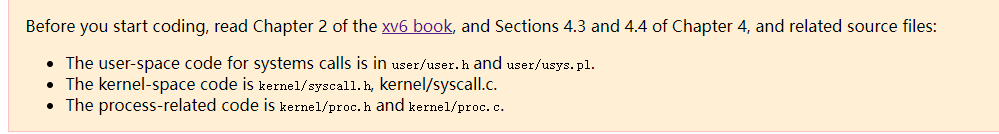
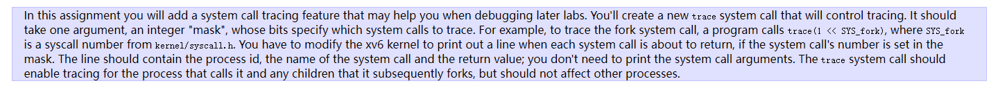
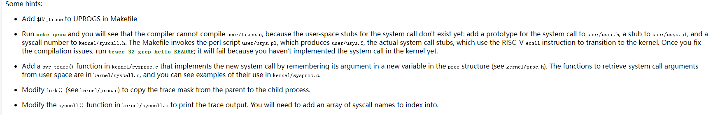
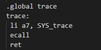
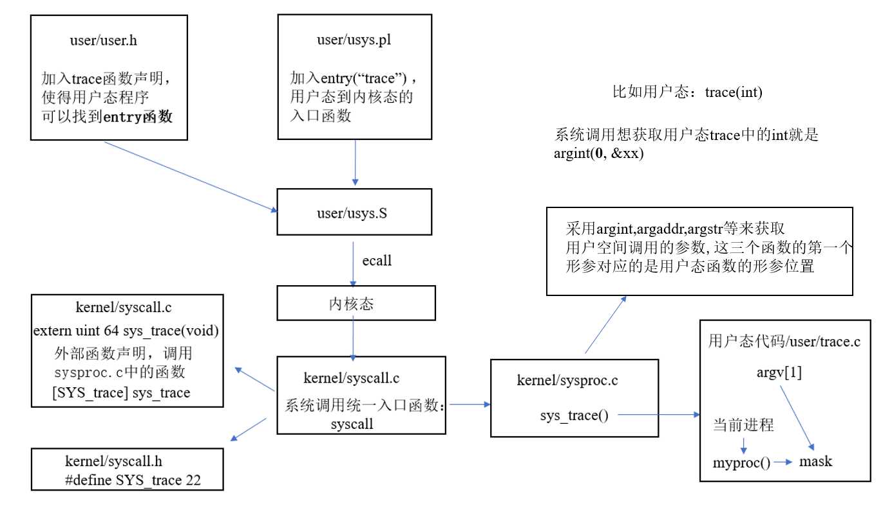
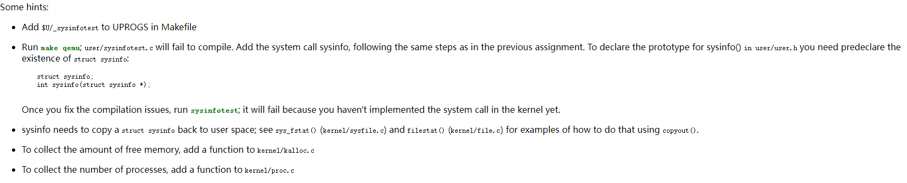
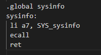

### Lab: Xv6 and Unix utilities

> - 题外话：git的暂存区工作区在所有分支中是公用的，在没有commit或者stash之前，分支之间变化是同步的
>
> - 如何从用户态转到内核态？
>   - 当用户程序执行系统调用，会通过ECALL触发一个软中断（software interrupt），软中断会查询操作系统预先设定的中断向量表，并执行中断向量表中包含的中断处理程序。中断处理程序在内核中，这样就完成了从用户态到内核态的切换，并执行用户程序想要执行的特殊权限指令。

> 此实验内容不同于实验1的用户功能（使用系统调用来实现一些功能），它涉及xv6内核，得看书，和相关源代码。本实验需要我们给xv6新加系统调用，能够让我们理解系统调用如何工作的
>
> 前期准备
>
> ```bash
> git fetch
> git checkout syscall //在进行这句话的时候确保实验一已经commit
> make clean
> ```



#### system call tracing(moderate)

> 首先，我们来看看实验要求和实验提示





> - 需要添加一个系统调用trace，对于后续实验的debug具有帮助。
> - 创建一个trace系统调用，包括一个参数mask，如果1 << 系统调用号==mask，那么就追踪该系统调用
> - 用户态中的代码trace.c已经写好了
> - 用户空间：user/user.h,user/usys.pl；内核空间：kernel/syscall.h,kernel/syscall.c; 进程相关:kernel/proc.h,kernel/proc.c

> 我们现在开始解决这个问题。
>
> 我们发现用户空间的trace.c代码已经写好了，但是进行make qemu的时候是无法编译通过的。我们需要进行以下步骤：
>
>  1. 在Makefile文件中添加$U/_trace\
>
>  2. 仿照其他系统调用在user/user.h中添加trace的函数原型，在user/usys.pl中添加stub，在kernel/syscall.h中添加系统调用号(SYS_trace)。（Makefile会调用/user/usys.pl，然后会产生usys.S，然后通过这个usys.S中汇编代码的桩函数的ecall指令（ecall是risc-v的一种中断方式）转进内核，进行系统调用。下图是usys.S中trace的汇编代码，我们可以看到将SYS_trace（系统调用号）赋值给a7寄存器
>
>     
>
>     ```c
>     // user/user.h
>     int trace(int);
>     ```
>
>     
>
> 	3. 然后查看kernel/syscall.c中的syscall函数，我们可以看到通过p->trapframe->a7来获得当前的系统调用号，之后通过syscall[num]\()统一的系统调用接口，进行系统调用，之后再根据具体的系统调用号执行相应的系统调用。如果此时系统调用号是SYS_trace，那么会执行sys_trace系统调用。根据提示，我们需要修改这个统一的系统调用syscall函数。risc-v将返回值保存在a0寄存器。
>
>     此外：需要**特别注意**的是
>
>     - 一定要在系统调用完成后再进行mask的赋值
>     - 在kernel/proc.h中，我们发现struc proc具有name，在输出追踪信息的时候，注意不能用p->name，这是进程的名字。因此需要额外定义一个指针数组，为了便于输出系统调用的名字
>
>     ```c
>     extern uint64 sys_trace(void);  //为了使kernel/syscall.c中能够调用kernel/sysproc.c
>     static uint64 (*syscalls[])(void) = {
>         ...
>         [SYS_trace]	 sys_trace
>     }
>     void syscall(void) {
>       int num;
>       struct proc *p = myproc();
>       num = p->trapframe->a7;
>      
>       /****新加***/
>       char* syscall_name[] = {"", "fork", "exit", "wait", "pipe", "read", "kill", 		"exec", "fstat", "chdir", "dup", "getpid", "sbrk", "sleep", "uptime", 
>           "open", "write", "mknod", "unlink", "link", "mkdir", "close",
>            "trace", "sysinfo"
>       };
>     
>       if(num > 0 && num < NELEM(syscalls) && syscalls[num]) {
>     
>         p->trapframe->a0 = syscalls[num]();
>     
>         /***新加***/
>         int mask = p->mask; //一定要在系统调用完成后再赋值
>         if ((mask >> num)) {
>           // printf("%d %d\n", mask, num);
>           printf("%d: syscall %s -> %d\n", p->pid, syscall_name[num], p->trapframe->a0); 
>         }
>     
>       } else {
>         printf("%d %s: unknown sys call %d\n",
>                 p->pid, p->name, num);
>         p->trapframe->a0 = -1;
>       }
>     }
>     ```
>
> 	4. 以SYS_trace系统调用为例，在根据syscall.c的系统调用后，会进入到kernel/sysproc.c中的sys_trace函数，函数形参核返回值可以参考其他系统调用的写法。根据提示我们需要在进程的数据结构中加一个mask，用来记录1<<系统调用，然后在调用sys_trace的时候将trace后面接的参数值赋值给进程的mask成员变量。下面代码块中的argint就是用来传递系统调用参数的，将p->trapframe->a0的值传给n。就比如执行命令trace 32 grep hello README，这时候32就是系统调用的第一个参数执行argint(0, &n)就是将32赋值给n
>
>     ```c
>     // kernel/proc.h
>     struct proc {
>     	...
>     	int mask;
>     }
>     
>     // kernel/sysproc.c
>     uint64 sys_trace(void) {
>     
>       int n;
>       if (argint(0, &n) < 0) {
>         return -1;
>       }
>       myproc()->mask = n;
>       return 0;
>     }
>     ```
>
>     此外，需要**额外注意的是**在执行sys_trace系统调用的时候会对进程数据结构中的mask成员变量进行赋值，那么不进行trace系统调用的时候mask值应该为多少呢？显然，我们要在创建进程的同时就对其进行显示初始化，将其初始化为0，否则是个随机数。
>
>     ```c
>     //kernel/proc.c
>     static struct proc* allocproc(void) {
>     	...
>     	p->mask = 0; //most important plus
>       	return p;
>     }
>     ```
>
> 	5. 根据提示，我们还需要对fork进行修改，将mask值从父进程传递给子进程
>
>     ```c
>     //kernel/proc.c
>     int fork(void) {
>         ...
>       acquire(&np->lock);
>       np->state = RUNNABLE;
>       np->mask = p->mask; //plus
>       release(&np->lock);
>       return pid;
>     }
>     ```
>
> 	6. 至此，就已经完成了trace部分。
>
> 总结[(134条消息) MIT 6.S081 Lab2_NP_hard的博客-CSDN博客](https://blog.csdn.net/NP_hard/article/details/121300903)
>
> 总结：那么，这个trace系统调用实现后，xv6是如何进行系统调用的呢？下面给出大体的调用过程。



#### sysinfo(moderate)

> 首先，我们来看看实验要求和实验提示




> - 需要添加一个系统调用sysinfo，功能是收集运行系统的信息。
> - 这个系统调用包括一个参数，struct sysinfo*，struct sysinfo见(kernel/sysinfo.h)。
> - 系统调用需要给struct sysinfo中的成员变量freemem(空闲内存的字节数)和nproc(使用的进程数)赋值。
> - 用户态中的代码sysinfotest.c已经给出

> 我们现在开始解决这个问题。
>
> 我们发现用户空间的sysinfotest.c代码已经写好了，但是进行make qemu的时候是无法编译通过的。我们需要进行以下步骤：
>
>  1. 在Makefile文件中添加$U/_sysinfotest\
>
>  2. 仿照其他系统调用在user/user.h中添加sysinfo的函数原型，在user/usys.pl中添加stub，在kernel/syscall.h中添加系统调用号(SYS_sysinfo)。（Makefile会调用/user/usys.pl，然后会产生usys.S，然后通过这个usys.S中汇编代码的桩函数的ecall指令（ecall是risc-v的一种中断方式）转进内核，进行系统调用。下图是usys.S中sysinfo的汇编代码，我们可以看到将SYS_trace（系统调用号）赋值给a7寄存器
>
>     
>
>     ```c
>     //user/user.h
>     struct sysinfo;
>     int sysinfo(struct sysinfo*);
>     ```
>
>     
>
> 	3. 然后查看kernel/syscall.c中的syscall函数，我们可以看到通过p->trapframe->a7来获得当前的系统调用号，之后通过syscall[num]\()统一的系统调用接口，进行系统调用，之后再根据具体的系统调用号执行相应的系统调用。如果此时系统调用号是SYS_sysinfo，那么会执行sys_sysinfo系统调用。根据提示，我们需要修改这个统一的系统调用syscall函数。risc-v将返回值保存在a0寄存器。
>
>     ```c
>     extern uint64 sys_sysinfo(void);  //为了使kernel/syscall.c中能够调用kernel/sysproc.c
>     static uint64 (*syscalls[])(void) = {
>         ...
>         [SYS_sysinfo]	 sys_sysinfo
>     }
>     
>     ```
>
> 	4. 根据提示，我们需要将kernel/sysinfo.h中定义的struct sysinfo中的成员变量freemem和nproc赋值，需要在kernel/kalloc.c和kernel/proc.c中分别各自添加int getFreeMem(void)函数和getNumOfProcesses(void)函数
>
>     - getFreeMem函数：其实就是通过维护一个freelist来free和alloc，迭代指针是run，每页大小是PGSIZE。
>     - getNumOfProcesses函数，参考同文件中的procdump即可
>
>     ```c
>     //kernel/kalloc.c
>     
>     //该函数实现稍微复杂一些，需要通过阅读代码，了解数据结构才能了解
>     int getFreeMem(void) {
>       struct run *r;
>       acquire(&kmem.lock);
>       int freeMem = 0;
>       r = kmem.freelist;
>       while(r) {
>         freeMem += PGSIZE;
>         r = r->next;
>       }
>       release(&kmem.lock);
>       return freeMem;
>     }
>     
>     
>     
>     //kernel/proc.c
>     // 获取空闲的进程数量,参考proc.c文件中的procdump即可完成
>     int getNumOfProcesses(void) {
>       //获取不是UNUSED的进程
>       int numOfProcesses = 0;
>       struct proc *p;
>     
>       for(p = proc; p < &proc[NPROC]; p++){
>         acquire(&p->lock);
>         if(p->state == UNUSED) {
>           release(&p->lock);
>           continue;
>         }
>     
>         else {
>           numOfProcesses = numOfProcesses + 1;
>           release(&p->lock);
>         }
>       }
>       return numOfProcesses;
>     }
>     
>     ```
>
> 	5. 根据提示，需要将struct sysinfo拷贝（copyout）回用户空间，可以参考kernel/sysfile.c中的sys_fstat函数和kernel/file.c。然后需要将sysinfo结构中的freemem和nproc调用前面实现的两个函数来设置。并且sysinfo只有一个形参（struct sysinfo*），所以就是argaddr(0, &addr)来获取。拷贝就是赋值sinfo结构体的内容到用户传来的地址。
>
>     - copyout(myproc()->pagetable, addr, (char*)&sinfo,sizeof(sinfo))就是复制结构体sysinfo的内容到sysinfo的形参地址（目的地址addr）处，myproc()->pagetable就是相当于进程的物理地址（源地址）
>
>     ```c
>     // kernel/sysproc.c
>     uint64 sys_sysinfo(void) {
>     
>       struct sysinfo sinfo; //内核
>       uint64 user_addr; //user pointer to struct sysinfo
>       if (argaddr(0, &user_addr) < 0) {
>         return -1;
>       }
>       sinfo.freemem = getFreeMem();
>       sinfo.nproc = getNumOfProcesses();
>     
>     
>       if(copyout(myproc()->pagetable, user_addr, (char *)&sinfo, sizeof(sinfo)) < 0)
>         return -1;
>       return 0;
>       
>     }
>     ```
>
> 	6. 至此，就已经完成了sysinfo部分

#### 测试

```bash
make qemu
ctrl+a+x //退出
./grade-lab-syscall trace
./grade-lab-syscall sysinfotest
```

