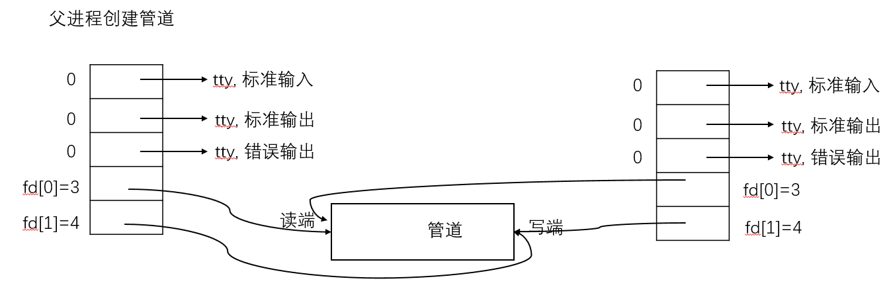
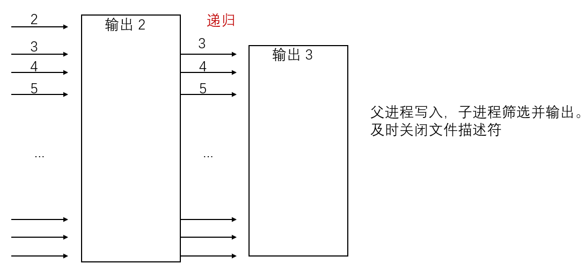

### Lab: Xv6 and Unix utilities

#### Boot xv6(easy)

> ```bash
> git clone git://g.csail.mit.edu/xv6-labs-2021
> cd xv6-labs-2021
> git checkout util
> make qemu
> ```
>
> - 运行：make qemu
> - 退出：ctrl+a+x
> - 写完代码后，需要在Makefile里加入需要编译的文件名字

#### sleep(easy)

> - 对xv6实现sleep unix程序，sleep程序应该暂停用户指定的tick数量。tick是xv6内核定义的时间的概念，即在计时芯片中的两个中断的时间。
>
>   ```c
>   #include "kernel/types.h"
>   #include "kernel/stat.h"
>   #include "user/user.h"
>   
>   int main(int argc, char *argv[])
>   {
>       int i;
>       if(argc < 2 || argc > 3){
>           fprintf(2, "Usage: sleep number ticks...\n");
>           exit(1);
>       }
>   
>       i = 1;
>       int ticks = atoi(argv[i]);
>       if (ticks < 0) {
>           fprintf(2, "number ticks are invalid. \n");
>           exit(1);
>       }
>       sleep(ticks);
>       exit(0);
>   }
>   
>   ```

#### pingpong(easy)

> - 首先介绍管道的概念
>
>   - 管道是一种最基本的IPC(进程间通信)机制，作用于有血缘关系的进程之间，完成数据传递。
>   - int pipe(int fd[2])，成功：0，失败：-1
>   - 函数调用成功后返回r、w两个文件描述符。无需open，但需要手动close，规定：fd[0]->r；fd[1]->w，就像0对应标准输入，1对应标准输出一样。向管道文件读写数据其实是在读写内核缓冲区
>
> - 有如下特质：
>
>   - 本质是一个伪文件（实为内核缓冲区）
>   - 有两个文件描述符引用，一个表示读端，一个表示写端
>   - 规定数据从管道的写端流入管道，从读端流出
>
> - 管道的局限性
>
>   - 数据自己读不能自己写
>   - 数据一旦被读走，便不在管道中存在，不可反复读取
>   - 采用半双工通信，数据一次只能在一个方向上流动
>   - 会自己进行阻塞，比如一方在读取，管道内没有数据的话会进行阻塞。
>
> - 示意图
>
>   
>
> - 代码如下：
>
>   ```c
>   #include "kernel/types.h"
>   #include "kernel/stat.h"
>   #include "user/user.h"
>   
>   int main(int argc, char *argv[])
>   {
>       int pid;
>       char buf[1];
>       int fd[2];
>       char* pSend = "p"; //parent send
>       char* cSend = "c"; //child send
>       //1. 创建管道, 创建成功后fd[0]是读端, fd[1]是写端
>       if (pipe(fd) == -1) {
>           printf("pipe error.\n");
>           exit(-1);
>       }
>   
>       // 新建子进程
>       pid = fork();
>       if (pid < 0) {
>           printf("fork error.\n");
>           exit(1);
>       }
>       else if (pid == 0) { //为子进程
>           read(fd[0], buf, sizeof(buf));
>           printf("%d: received ping\n", getpid());
>           write(fd[1], cSend, 1);
>   
>       }
>       else { //为父进程, 给子进程发送消息
>           write(fd[1], pSend, 1);
>           read(fd[0], buf, sizeof(buf));
>           printf("%d: received pong\n", getpid());
>       }
>       exit(0);
>   
>   }
>   
>   ```
>

#### primes(moderate/hard)

> - 功能是输出2-35之间的素数，实现方式是递归fork并使用管道链接。父进程进行写入，子进程进行筛选。
>
> - write可以直接写整数write(fd, &i, sizeof(int))，不需要声明字符数组，然后再进行写入
>
> - 需要注意的是xv6的文件描述符和进程数量有限，因此需要及时关闭文件描述符。
>
>   ```
>   ssize_t read(int fd, void *buf, size_t count)：从打开的设备或文件中读取数据
>   返回值：成功返回读取的字节数，出错返回-1并设置errno，如果在调read之前已达到文件末尾，则这次read返回0
>   ssize_t write(int fd, const void *buf, size_t count):函数向打开的设备或文件中写数据
>   返回值：成功返回写入的字节数，出错返回-1并设置errno，写常规文件时，write的返回值通常等于请求写的字节数count，而向终端设备或网络写则不一定
>   ```
>
>   
>
> - 代码：
>
>   ```c
>   #include "kernel/types.h"
>   #include "kernel/stat.h"
>   #include "user/user.h"
>   
>   // 子进程主要是负责读的,因此要关闭写端
>   int subProcess(int *oldFd) {
>   
>       close(oldFd[1]);
>       int fd[2];
>       int primeNumber;
>       int num;
>       int pid;
>       
>       if (read(oldFd[0], &primeNumber, sizeof(int))) {
>           //第一个数为质数
>           printf("prime %d\n", primeNumber);
>           
>           //递归
>           if (pipe(fd) == -1) {
>               printf("pipe error.\n");
>               exit(-1);
>           }
>   
>           pid = fork();
>           if (pid < 0) {
>               printf("fork error.\n");
>               exit(1);
>           }
>           else if (pid == 0) {
>               subProcess(fd);
>           } else {
>               //主进程主要是负责写的，因此要关闭读端
>               close(fd[0]);
>               while (read(oldFd[0], &num, sizeof(int))) {
>                   if (num % primeNumber != 0) { //除以2不能除尽的,除以2不能除尽且除以3不能除尽的...
>                       write(fd[1], &num, sizeof(int));
>                   }
>               }
>               close(oldFd[0]);
>               close(fd[1]);
>               wait(0);            
>           } 
>       } else {
>           close(oldFd[0]);
>       }
>       exit(0);
>   
>   }
>   
>   int main(int argc, char *argv[])
>   {
>   
>       int pid;
>       int fd[2];
>       int i;
>       if (pipe(fd) == -1) {
>           printf("pipe error.\n");
>           exit(-1);
>       }
>   
>       pid = fork();
>       if (pid < 0) {
>           printf("fork error.\n");
>           exit(1);
>       }
>       else if (pid == 0) {
>           subProcess(fd);
>       }
>       else {
>           //主进程主要是负责写的，因此要关闭读端
>           close(fd[0]);
>           for (i = 2; i <= 35; i++) {
>               write(fd[1], &i, sizeof(int));
>           }
>           close(fd[1]);
>           wait(0);
>       }
>       exit(0);
>   }
>   
>   ```

#### find(moderate)

> - 对xv6实现find unix程序，在目录树中查找所有带有特定名字的文件
>
> - 需要注意的是对于"."和".."文件夹需要跳过
>
> - 对于文件类型，如果与目标文件名匹配，那么直接输出，找到目标；对于文件夹类型，”.“和".."跳过，其他进行递归。
>
> - 参考ls即可
>
> - 代码
>
>   ```c
>   #include "kernel/types.h"
>   #include "kernel/stat.h"
>   #include "user/user.h"
>   #include "kernel/fs.h"
>   
>   
>   //切除路径的最后一级，例如 /xx/xx, 就会被xx截出来例如xx.py就直接把xx.py截出来
>   char* fmtname(char *path)
>   {
>       // static char buf[DIRSIZ+1];
>       char *p;
>   
>       // Find first character after last slash.
>       for(p=path+strlen(path); p >= path && *p != '/'; p--)
>           ;
>       p++;
>   
>       return p;
>   
>       // Return blank-padded name.
>       // if(strlen(p) >= DIRSIZ)
>       //     return p;
>       // memmove(buf, p, strlen(p));
>       // memset(buf+strlen(p), ' ', DIRSIZ-strlen(p));
>       // return buf;
>   }
>   
>   
>   void find(char *path, char *targetFileName) {
>       char buf[512], *p;
>       int fd;
>       struct dirent de;
>       struct stat st;
>       if((fd = open(path, 0)) < 0){
>           fprintf(2, "ls: cannot open %s\n", path);
>           return;
>       }
>   
>       if(fstat(fd, &st) < 0){
>           fprintf(2, "ls: cannot stat %s\n", path);
>           close(fd);
>           return;
>       }
>   
>       switch(st.type){
>   
>           //是文件
>           case T_FILE:
>   
>               //输出文件名
>               if (strcmp(fmtname(path), targetFileName) == 0) {
>                   printf("%s\n", path);
>               }
>               break;
>   
>           case T_DIR: 
>               
>               // printf("%s\n", path);
>   
>               if(strlen(path) + 1 + DIRSIZ + 1 > sizeof buf){
>                   printf("find: path too long\n");
>                   break;
>               }
>   
>               strcpy(buf, path);
>               p = buf+strlen(buf);
>               *p++ = '/'; //buf的前半部分存路径,以/隔开
>   
>               // 循环读取文件夹下的文件,文件名为de,name
>               while(read(fd, &de, sizeof(de)) == sizeof(de)){
>   
>                   // printf("%s\n", de.name);
>                   if(de.inum == 0 || strcmp(de.name, ".") == 0 || strcmp(de.name, "..") == 0)
>                       continue;
>   
>                   memmove(p, de.name, DIRSIZ);
>                   p[DIRSIZ] = 0;
>   
>                   if(stat(buf, &st) < 0){
>                       printf("ls: cannot stat %s\n", buf);
>                       continue;
>                   }
>   
>                   // 递归方式1
>                   int before = strlen(path);
>                   char *tmp = path + before;
>                   *tmp++ = '/';
>                   strcpy(tmp, fmtname(path));
>                   int after = strlen(path);
>                   find(buf, targetFileName);
>                   //回溯
>                   memset(path+before, 0, after-before);
>   
>                   //递归方式2
>                   // find(buf, targetFileName);            
>               }
>               break;
>       }
>       close(fd);
>   }
>   
>   int main(int argc, char *argv[])
>   {
>   
>   
>       if (argc != 3) {
>           fprintf(2, "args error. \n");
>           exit(1);
>       }
>       
>       find(argv[1], argv[2]);
>       exit(0);
>   }
>   
>   ```
>
> - 注意：find和ls的fmtname函数是不同的，ls后面部分会用空格进行填充，find则不需要；此外，还需要注意的是，比如输入命令find . b，这时候的argc是3，argv[0]是find，argv[1]是.，argv[2]是b。

#### xargs(moderate)

> - xargs和管道pipe是两个很容易混淆的东西，我们来看以下区别：
>
>   ```bash
>   echo '--help' | cat
>   #输出：‘--help’
>   echo '--help' | xargs cat相当于cat --help
>   ```
>
> - xargs后面的命令默认是echo，xargs等同于xargs echo
>
> - 通过上面的例子我们可以得出下面的结论，管道可以实现将前面的标准输出作为后面的标准输入，但是管道无法实现将前面的标准输出作为后面的命令参数。
>
> - 需要测一下echo -e "a\nb\nc" | xargs -L 1 echo的argc和argv，经过测试发现argc为4，argv[0]是"xargs"，argv[1]是""-L"，argv[2]是”1“，argv[3]是"echo"，后续的参数就是"-e "a\nb\nc"。
>
> - 一般执行exec的命令都是和fork进行结合，在子进程中执行exec操作，exec如果正常执行则不返回，正常执行时会加载新的程序到内存，相当于新程序替换了之前的进程，然后执行新进程，只有执行失败的时候才会返回。exec执行失败返回-1.
>
> - 这里说明一下xargs带参数和不带参数情况会有些许区别，比如echo hello | xargs和echo hello | xargs echo。
>
>   - 对于echo hello | xargs，argc=1，所以params[0]默认是"echo"，后续的参数就是params[argc]=buf，buf是前面管道传过来的参数
>   - 对于echo hello | xargs echo，argc=2，params[i-1]=argv[i]，i从1开始。因此，遍历参数结束后，params就一个元素，也就是指向"echo"字符串的指针，后续的参数就是params[argc-1]=buf，这里体现了些许差别
>   - 对于前面管道传过来的参数可以直接当一个字符串传过来即可，**exec能够处理带空格的字符串**。
>
> - 代码如下：
>
>   ```c
>   #include "kernel/types.h"
>   #include "kernel/stat.h"
>   #include "user/user.h"
>   #include "kernel/param.h"
>   
>   #define MAXLEN 32
>   
>   
>   int main(int argc, char *argv[])
>   {
>       // for (int i = 0; i < argc; i++) {
>       //     printf("%s\n", argv[i]);
>       // }
>   
>       char buf[MAXARG*MAXLEN];
>       char* params[MAXARG];
>       int i;
>       int len;
>   
>       if(argc < 1){
>           printf("usage: xargs your_command\n");
>           exit(1);
>       }
>   
>   
>       if (argc + 1 > MAXARG) {
>           printf("too many args\n");
>           exit(1);
>       }
>       if (argc > 1) {
>           for (i = 1; i < argc; i++) {
>               params[i-1] = argv[i];
>           }
>       }
>       else {
>           params[0] = "echo";
>       }
>   
>       params[argc] = 0;
>       while (1) {
>   
>           i = 0;
>           // read a line
>           while (1) {
>   
>               len = read(0, &buf[i], 1); //读的是前面的参数
>               if (len == 0 || buf[i] == '\n') break;
>               i++;
>           }
>           if (i == 0) break;
>           buf[i] = 0;
>   
>           //xargs后不接参数和接参数的情况略有不同, exec是可以处理带空格的情况的,区别体现所在
>           if (argc > 1) {
>               params[argc-1] = buf;
>           }
>           else {
>               params[argc] = buf;
>           }
>   
>           if (fork() == 0) {
>               exec(params[0],params);
>               exit(0);
>           } else {
>               wait(0);
>           }
>       }
>       exit(0);
>   }
>   ```
>

如果父进程有多个子进程，wait会在第一个子进程完成时再退出，如果一个进程调用fork两次，这个进程想要等两个子进程都退出，它需要调用wait两次。