risc-v的isa

> 需要注意的是pc寄存器保存的是**当前运行代码的地址**而不是下一条
>

gdb调试常用指令

> ```bash
>make CPUS=1 qemu-gdb
> 
> gdb-multiarch
> 
> 调试指定可执行文件：file 可执行文件
> 
> layout split #查看源代码和汇编代码
> ni #单步执行汇编（不进函数）
> si #单步执行汇编（进入函数）
> n #单步执行源码（不进函数）
> s #单步执行源码（进入函数）
> 
> p $a0 #打印寄存器a0的值
> i r a0 #查看寄存器a0的值
> p/x 1536 #以16进制打印1536
> x/i 0x630 #查看0x630地址处的指令
> x /x addr #查看addr地址处的值
> 
> b *addr：使断点停到address地址处
> ```
> 

### Lab:  traps

> 需要注意的是我们做的实验是2021的，因此要找到2021的指导书
>
> 前期准备
>
> ```bash
> git fetch
> git checkout traps //在进行这句话的时候确保实验一已经commit
> make clean
> ```

#### RISC-V assembly(easy)

首先，我们来看看实验要求：

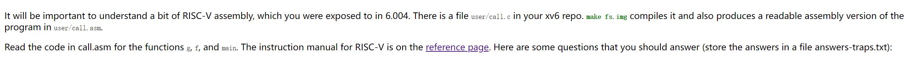

> - gdb调试步骤：
>
>   ```bash
>   make CPUS=1 qemu-gdb #终端A
>   
>   gdb-multiarch #在另一个终端B输入
>   ```
>
> - 因为我们要调试用户空间中的call，因此要先将用户空间中的call的可执行程序加载进gdb中才能进行调试。否则默认调试的是内核空间。
>
>   ```bash
>   file .../usr/_call
>   b main
>   c
>   #在终端A输入ls发现有call命令，因此在bash上输入call
>   #在终端A输入call后会出发终端B在call.c中打的断点,后面便可用gdb的命令进行调试
>   
>   ```
>
> - 使用上述调试命令layout split，我们可以知道
>
>   ```assembly
>    28:	00000517          	auipc	ra,0x0
>   ```
>
>   auipc就是将当前指令的地址（pc寄存器的值）+立即数赋给ra寄存器
>
> - 问题：
>
>   - Which registers contain arguments to functions? For example, which register holds 13 in main's call to `printf`?
>   - Where is the call to function `f` in the assembly code for main? Where is the call to `g`? (Hint: the compiler may inline functions.)
>   - At what address is the function `printf` located?
>   - What value is in the register `ra` just after the `jalr` to `printf` in `main`?
>   - 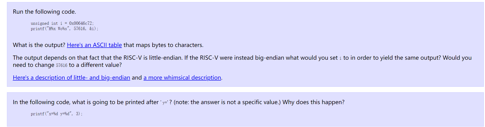
>
> - 答案：
>
>   - a2
>
>   - 没有在汇编里找到函数调用，因此根据提示，可以推断出编译器做了内联优化
>
>   - 0000000000000630（ra=0x030+1536=0x0630）(layout split, si)
>
>     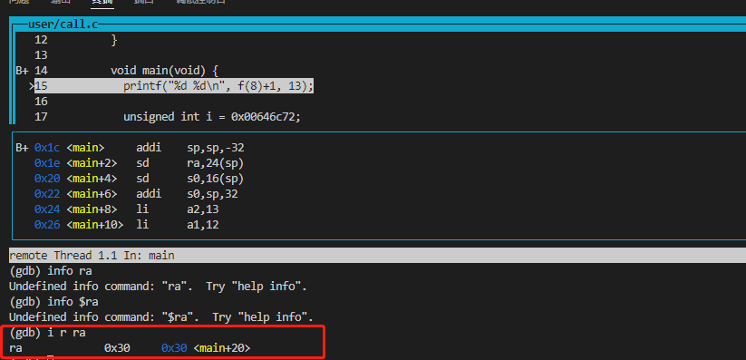
>
>     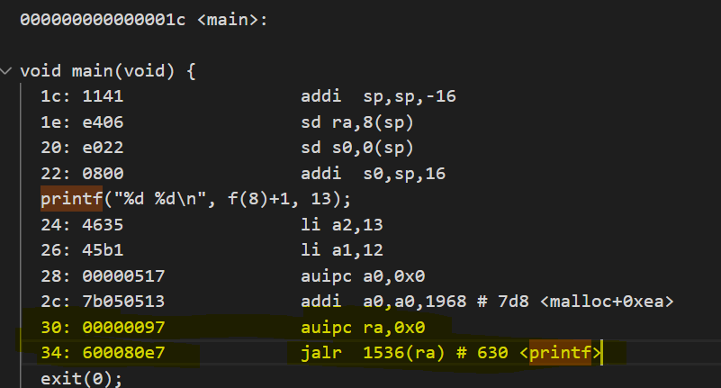
>
>     
>
>   - 0000000000000038（main函数调用函数printf后，ra存的是printf的返回地址，也就是main函数里printf函数的下一条地址）
>
>     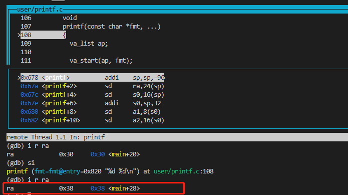
>
>   - 按照上述要求添加了给定的代码后，结果如下：
>
>     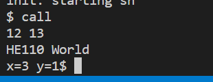
>
>     He110 World(小端序：高位存在高地址，低位存在低地址)
>
>   - 0x726c6400（大端序的i值）
>   
>   - 经过gdb调试发现，a0 是 format 字符串地址，a1 为传入的 3，a2 应该是函数调用中没有清理掉的垃圾值，因此输出了上述结果。根据main函数的汇编我们可以知道printf的第一个参数是字符串，保存在a0，第一个保存在a1，第二个保存在a2。在这个情况下输入y=1，可能是a2还未被清空。
>   
>   - 0x78正好是x，是printf第一个参数字符串的首个字母
>   
>     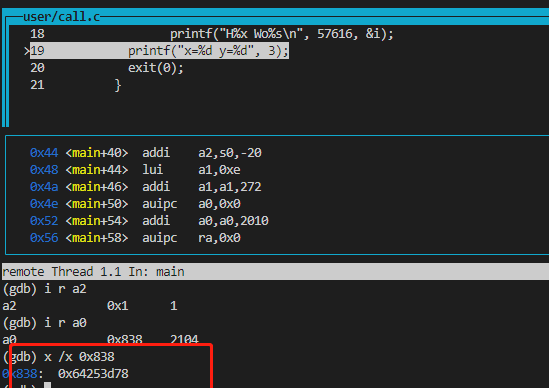
>     
>     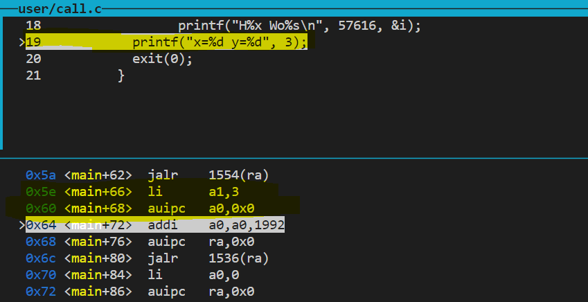

#### Backtrace ([moderate](https://pdos.csail.mit.edu/6.S081/2021/labs/guidance.html))

系统调用及恢复过程：

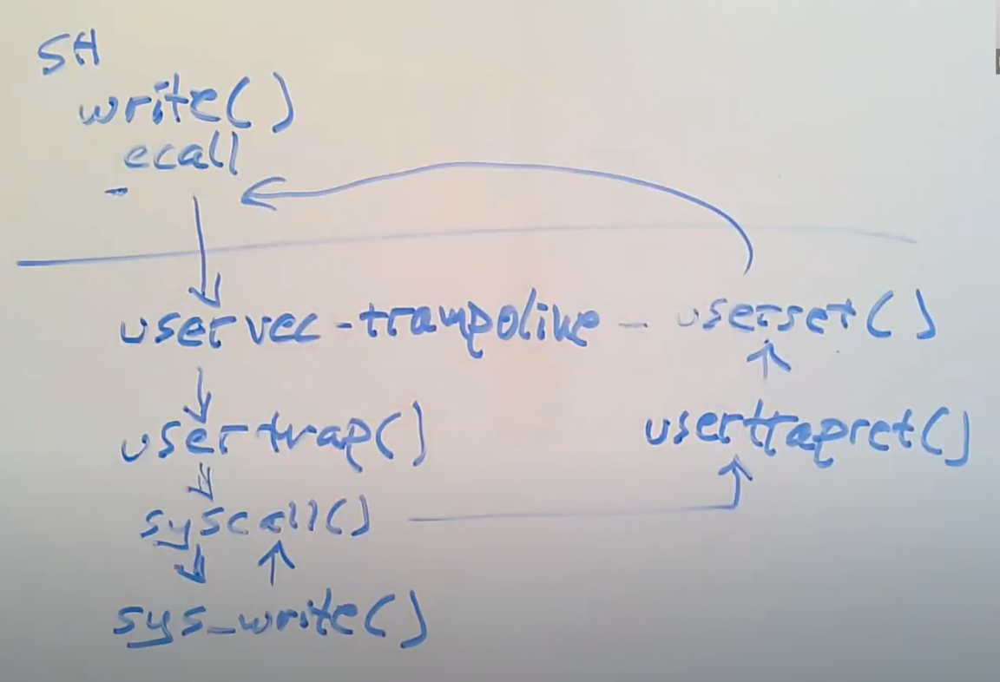

ecall指令是从用户空间转入到内核空间的

> 首先，我们来看看实验要求和实验提示

看栈帧结构图，该任务主要是实现函数的追踪，将栈中的函数调用的返回地址给打印出来，下面这张图对理解这个任务十分有作用。

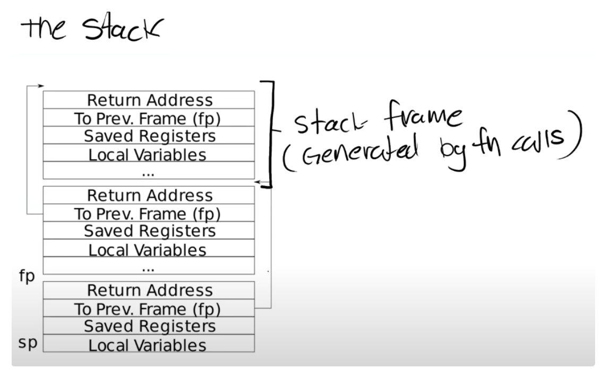

1. 栈顶地址-8是返回地址（return address），栈顶地址-16是上一个栈帧的地址（To Prev.Frame）。栈是向下增长的。

2. 关于栈帧中有两个重要的寄存器。第一个是SP，它指向stack的底部并代表了当前栈帧的位置，第二个是FP，它指向当前栈帧的顶部。因为返回地址和前一个栈帧的指针都在栈帧中的固定位置，所以可以通过当前的FP寄存器寻址到这两个数据。

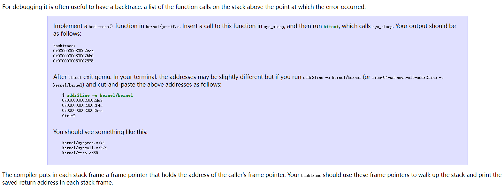

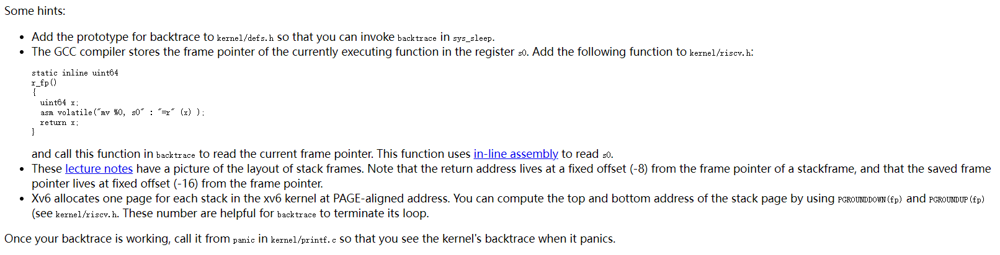

> ```c
> // kernel/printf.c
> //fp-8指向返回地址,就相当于fp-8是一个指针,因此需要解引用才能取出具体的地址
> void backtrace(void)
> {
>   printf("backtrace:\n");
>   uint64 fp = r_fp();
>   uint64 base = PGROUNDUP(fp); //获得栈底地址
>   while (fp < base) {
>     printf("%p\n", *(uint64 *)(fp-8));
>     printf("%p\n", *((uint64 *)(fp-8)));
>     fp = *((uint64 *)(fp-16));
>   }
> }
> 
> //kernel/defs.h
> // printf.c
> void            backtrace(void);
> 
> 
> //kernel/sysproc.c
> uint64 sys_sleep(void) {
> int n;
> uint ticks0;
> 
> if(argint(0, &n) < 0)
>  return -1;
> backtrace();
>  ...
> }
> ```
>
> 至此，就完成了这一部分。
>
> 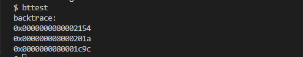

#### Alarm ([hard](https://pdos.csail.mit.edu/6.S081/2021/labs/guidance.html))

> 首先，我们来看看实验要求和实验提示。

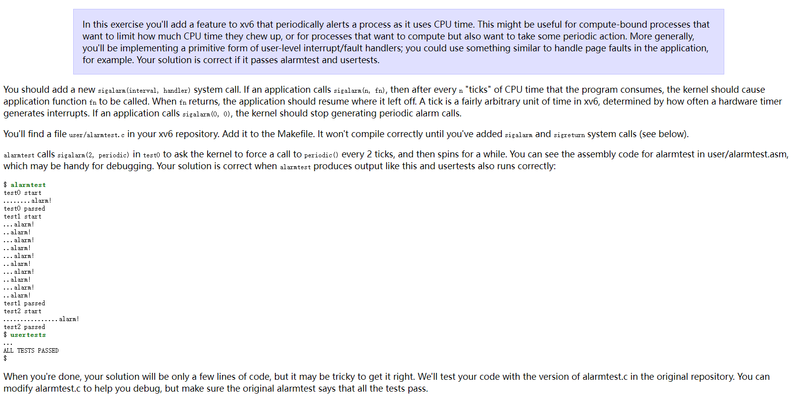

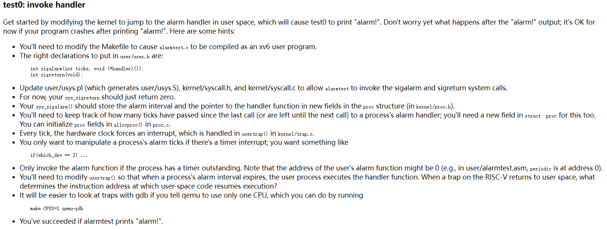

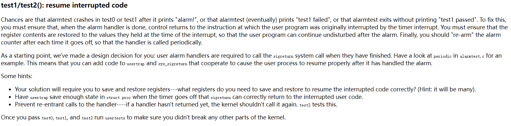

> - 我们现在根据提示来解决这个问题
>
> - 提示：
>   - 添加系统调用sigalarm(interval, handler)。（此处囊括添加系统调用的步骤）
>   - 在Makefile中添加sigalarm和sigreturn
>   - 在user/alarmtest.c中可以看到
>
> - 大体步骤：
>   - 首先，先正常按照系统调用的步骤添加sigalarm和sigreturn，并且在Makefile文件中添加对应的目标文件
>   - 在每次时钟中断处，将时钟计数器+1. 若计数器达到时钟间隔，则
>     先保存进程的用户上下文 trapframe
>     回调函数运行标志位置1
>     通过设置程序计数器调用回调函数
>   - 回调函数调用完毕后，需要回到最初被计时器中断的用户程序中断的指令。test程序会调用 sigreturn，sigreturn 需要做的事有：
>     重置计数器
>     还原进程用户上下文trapframe
>
> ```c
> //1. 添加系统调用
> 略过
> //2.  kernel/proc.h
> struct proc {
>     int interval;
>     uint64 handler;
>     int ticks;
>     int run_handler;
>     struct trapframe trapframe_cp;
> }
> //3. kernel/proc.c
> static struct proc* alloproc(void) {
>     p->pid = allocpid();
>     p->interval = 0;
>     p->ticks = 0;
>     p->handler = 0;
> 	p->run_handler = 0;
> }
> 
> //4. kernel/sysproc.c
> uint64 sys_sigalarm(void)
> {
>   int interval;
>   uint64 pointer;
>   if (argint(0, &interval) < 0) {
>     return -1;
>   }
>   if (interval < 0) return -1;
>   if (interval == 0) return 0;
>   if (argaddr(1, &pointer) < 0) {
>     return -1;
>   }
>   myproc()->handler = pointer;
>   myproc()->ticks = 0;
>   myproc()->run_handler = 0;
>   myproc()->interval = interval;
>   return 0;
> }
> 
> //5. kernel/trap.c
> // give up the CPU if this is a timer interrupt.
> if(which_dev == 2) {
>     if (p->interval != 0) {
>       if (p->ticks == p->interval && p->run_handler == 0) {
>         p->ticks = 0;
>         p->run_handler = 1;
>         p->trapframe->epc = p->handler; //保证返回到用户空间时执行的地址
>         p->trapframe_cp = *(p->trapframe); //便于返回到用户空间时恢复
>       }
>       p->ticks++;
>     }
>     yield();
> }
> 
> //6. kernel/sysproc.c
> uint64 sys_sigreturn(void)
> {
>   //恢复
>   myproc()->run_handler = 0;
>   myproc()->ticks = 0;
>   *(myproc()->trapframe) = myproc()->trapframe_cp;
> 
>   return 0;
> }   
> ```
>
> - 至此，我们已经完成了任务
> - 引入run_handler的目的是为了防止递归进行系统调用，避免handler重入。因为达到interval后，会执行handler，然后将ticks置0后，又会重新进入，为了避免此情况的发生因此要引入；或者不引入，当触发handler的时候不将ticks置0也行。

**注意：**trapframe 中的 epc 设置为 handler，使得当前中断返回用户态执行 handler 函数

#### 测试

```bash
make qemu
ctrl+a+x //退出
./grade-lab-traps
make grade
```

#### 总结

> - 首先会调用系统调用sys_sigalarm。在调用之前，把所有的寄存器信息保存在trapframe中
> - 然后进入内核中执行sys_sigalarm函数，对其参数（ticks, interval）进行赋值
> - 赋值完成后sys_sigalarm系统调用就完成了。trapframe将保存的寄存器的值恢复。如果达到了规定的interval，将返回地址epc更改为handler函数，返回用户态后便开始执行handler函数
> - 执行完handler后，我们希望返回到调用handler前的状态，但是调用handler之前，epc已经被覆盖了。同时执行handler后寄存器也会发生变化。
> - 因此需要在handler覆盖掉epc之前保存相应寄存器的状态。
> - sigalarm(interval, handler)和sigreturn()两个函数是配合使用的，在handler函数返回前会调用sigreturn
> - 需要在struct proc中保存一个trapframe的副本（需要在覆盖epc之前），然后在调用sig_return()中将副本还原。